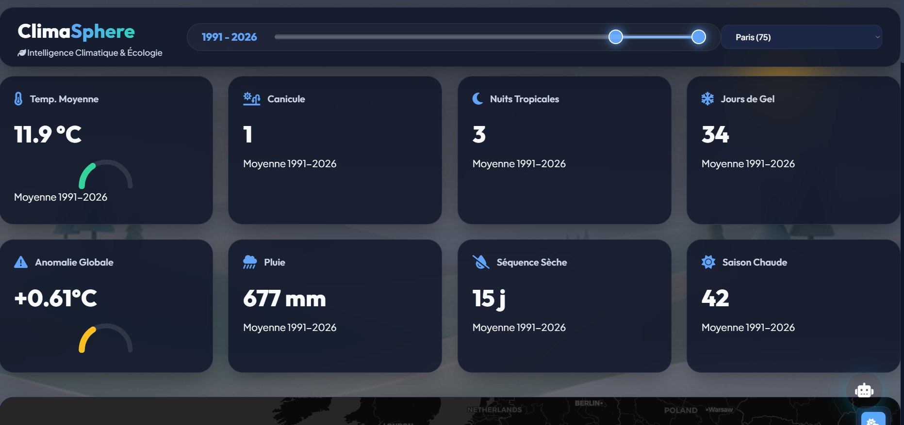
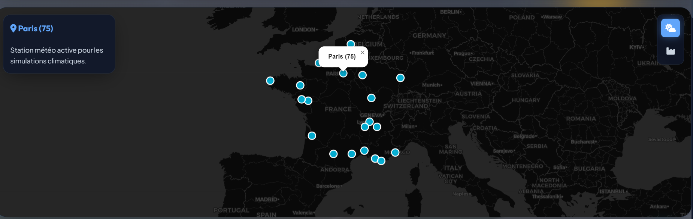
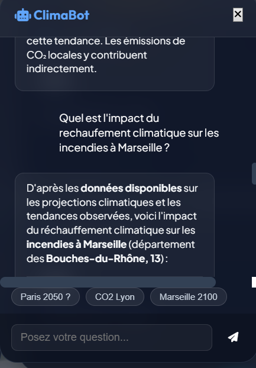
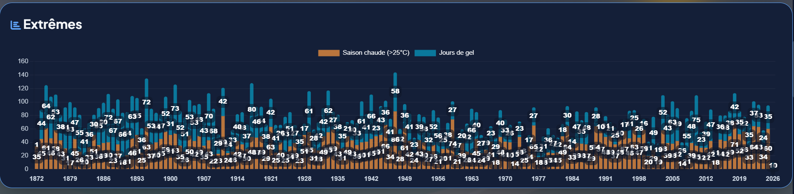

# 🌍 ClimaSphere : Intelligence Climatique & Écologie (Hackathon 2026)



## 📖 Présentation du Projet
**ClimaSphere** est un dashboard interactif de monitoring et de projection climatique conçu pour le Hackathon 2026. Il permet d'analyser l'impact du réchauffement climatique à l'échelle nationale (France) et départementale (20+ localisations) en croisant des données historiques réelles avec des modèles d'intelligence artificielle avancés.

### 🛠️ Tech Stack


---

## 🚀 Fonctionnalités Clés

### 1. Dashboard Interactif & Cartographie
*   **Visualisation Multi-Couches** : Basculez entre les données météo et les inventaires d'émissions CO2e.
*   **Zoom Territorial** : Plus de 20 départements français modélisés individuellement.
*   **Thème Premium** : Design "Midnight Nature" avec glassmorphism pour une expérience utilisateur moderne.



### 2. Simulation Temporelle Intelligente ⏳
*   **Curseur de Plage Unique** : Sélectionnez une année spécifique ou une période complète (ex: 1990-2025). 
*   **Agrégation Dynamique** : Les statistiques (Température, Canicules, Précipitations) calculent automatiquement les moyennes de période en temps réel.

### 3. ClimaBot : L'Expert IA Intégré 🤖
*   **Mistral AI Large** : Agent conversationnel spécialisé dans le climat français.
*   **Rendu Markdown Riche** : Analyse complexe présentée sous forme de tableaux, listes et titres structurés.
*   **Data-Driven** : Le chatbot a directement accès aux indicateurs du dashboard pour répondre précisément.



---

## 🧠 Méthodologie & IA

### Modélisation des Projections
Nous utilisons un pipeline hybride pour projeter 7 indicateurs climatiques majeurs jusqu'en **2100** :
1.  **Facebook Prophet** : Pour capturer les tendances saisonnières et les changements de trajectoire complexes.
2.  **Linear Regression** : En baseline de validation.
3.  **Ajustement Scientifique** : Intégration des deltas des scénarios du **GIEC (RCP 4.5 & 8.5 / SSP)**.


### Rigueur Scientifique & Performance
La fiabilité de nos modèles est transparente. Un onglet dédié permet de consulter les métriques d'erreur par département :
*   **RMSE** (Root Mean Square Error)
*   **MAE** (Mean Absolute Error)
*   **MAPE** (Mean Absolute Percentage Error)


---

## 📊 Analyse des Indicateurs

| Indicateur | Description | Pourquoi c'est important ? |
| :--- | :--- | :--- |
| **TM** | Température Moyenne | Signal global du réchauffement. |
| **DAYS_CANICULE** | Jours de forte chaleur | Risque santé et incendies. |
| **NIGHTS_TROPICAL** | Nuits > 20°C | Stress thermique nocturne. |
| **RR_TOTAL** | Précipitations annuelles | Gestion de la ressource en eau. |
| **DRY_SPELL_MAX** | Sécheresse max | Alerte sur le risque de désertification. |



---

## 🛠️ Installation & Pipeline

### 1. Installation des dépendances
```bash
pip install -r requirements.txt
```

### 2. Pipeline de données automatisé
Pour mettre à jour les données et relancer les modèles IA :
```bash
python automated_pipeline.py
```
*Le pipeline exécute successivement : Récupération → Transformation → Modélisation IA.*

### 3. Lancer le Dashboard
```bash
python app.py
```
Accès : `http://127.0.0.1:5000`

---

## 👥 Impact Citoyen
ClimaSphere ne se contente pas de montrer des chiffres. Une section dédiée propose des **recommandations concrètes** basées sur les projections locales pour aider les citoyens à s'adapter (végétalisation, isolation, gestion de l'eau).

---
**Développé par Groupe 1 Data - Sup de Vinci (Hackathon 2026)**
